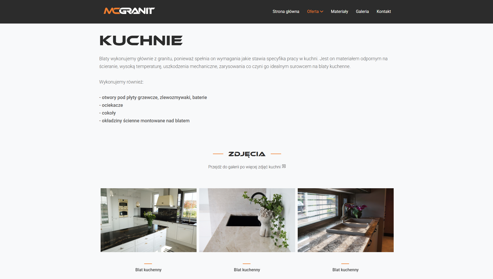

# McGranit - Website for a stonemasonry company

  

## Table of Contents
- 🚀 [Project Overview](#project-overview)
- ✨ [Features](#features)
- 💻 [Technologies](#technologies)
- 📋 [Requirements](#requirements)
- 🛠️ [Setup Instructions](#setup-instructions)
- 📸 [Screenshots](#screenshots)

## Project Overview

The **McGranit** website was created for a stonemasonry company, producing tombstones, kitchen countertops, stone stairs, etc. It presents, among other things, previously completed projects.
> [!NOTE]  
> The website is only available in Polish language version!

## Features

**Client**
- 📂 Offer divided into individual categories, allowing you to easily find information about the realization that interests you
- 🪨 Tab "Materiały" allowing you to get acquainted with the raw materials available for the manufacture of products
- 🖼️ Extensive gallery, presenting projects completed by the company

**Administrator**
- ➕ Easily add more materials and photos of completed projects

**Other features**
- 📱 Full responsiveness

## Technologies

**Frontend:**
- Bootstrap
- HTML
- JavaScript

## Requirements
Software versions used for development:
- Bootstrap 5.0
- XAMPP v3.3.0 (Apache Web Server) or other similar tool
> [!WARNING]  
> Compatibility with earlier versions has not been tested.

## Setup Instructions

1. Download this repository.
2. Unzip and place the project folder in `XAMPP\htdocs`.
3. In the XAMPP control panel, start **Apache Web Server**.
4. Launch the application in your browser at: `localhost/McGranit-Website-main/index.html`.

## Screenshots

  
  
  
  
  
  

### Mobile Device

 
