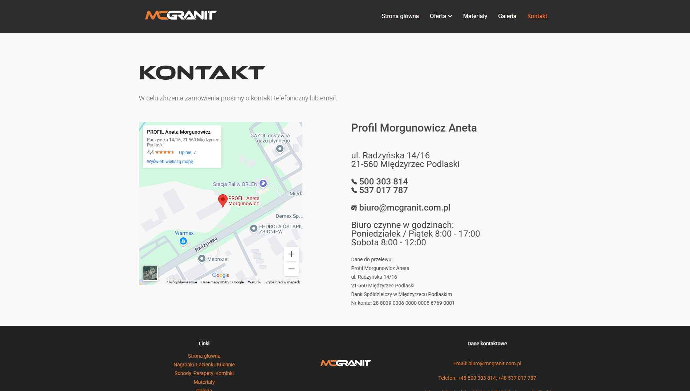

# Profil - Website for a stonemasonry company

  

## Table of Contents
- 🚀 [Project Overview](#project-overview)
- ✨ [Features](#features)
- 💻 [Technologies](#technologies)
- 📋 [Requirements](#requirements)
- 🛠️ [Setup Instructions](#setup-instructions)
- 📸 [Screenshots](#screenshots)

## Project Overview

The **Profile** website was created for a stonemasonry company, producing tombstones, kitchen countertops, stone stairs, etc. It presents, among other things, previously completed projects. **The website is only available in Polish language version!**

## Features

**Client**
- Offer divided into individual categories, allowing you to easily find information about the realization that interests you
- Tab "Materiały" allowing you to get acquainted with the raw materials available for the manufacture of products
- Extensive gallery, presenting projects completed by the company

**Administrator**
- Easily add more materials and photos of completed projects

**Other features**
- 📱 Full responsiveness

## Technologies

**Frontend:**
- Bootstrap
- HTML
- JavaScript

## Requirements
Software versions used for development (**compatibility with earlier versions has not been tested**):
- Bootstrap 5.0
- XAMPP v3.3.0 (Apache Web Server) or other similar tool

## Setup Instructions

1. Place the project folder `profil` in `XAMPP\htdocs`.
2. In the XAMPP control panel, start **Apache Web Server**.
3. Launch the application in your browser at: `localhost/profil/index.html`.

## Screenshots

  
  
  
  
  
  

### Mobile Device

 
